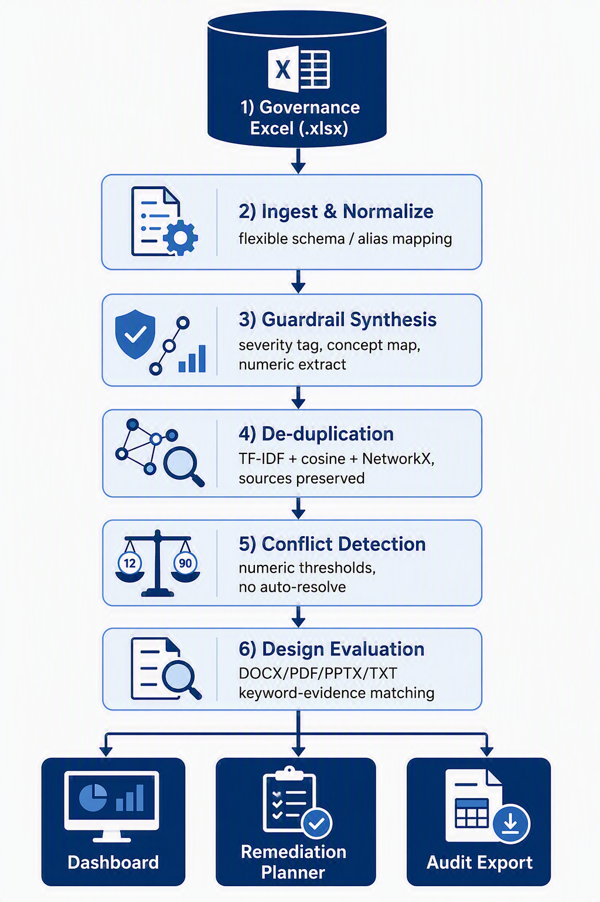

# 🛡️ GuardrailIQ — Deterministic GRC Compliance Copilot

Turn scattered governance documents into a **structured, de-duplicated, fully
traceable guardrail model**, then evaluate a design description against it —
where **every finding cites the exact guardrail and source clause** it came
from. Single-file Streamlit app. **No external LLM. 100% deterministic,
explainable and offline.**

---

## 📦 What's in this folder

```
GuardrailIQ/
├── app/
│   └── guardrailiq_app.py          # the entire application (single file)
├── data/
│   └── GuardrailIQ_Dataset_v2.xlsx # synthetic governance workbook (input)
├── sample_designs/                 # ready-to-evaluate demo designs
│   ├── DSN_clear_fail_admin_console.docx   # -> Non-compliant
│   ├── DSN_compliant_analytics.txt         # -> Compliant
│   └── DSN_gap_supplier.pptx               # -> Gap
├── diagram/
│   └── architecture_diagram.png    # solution architecture
├── docs/
│   ├── GuardrailIQ_Architecture_and_Build_Guide.docx  # full design doc
│   └── DOCUMENT_README.md          # what the design doc contains
├── requirements.txt
├── setup.bat                       # one-time setup (Windows)
├── run.bat                         # launch the app (Windows)
└── README.md                       # this file
```

---

## 🚀 Quick start (Windows)

```bat
setup.bat      :: one-time: creates .venv and installs dependencies
run.bat        :: launches the app at http://localhost:8501
```

## 🚀 Quick start (macOS / Linux)

```bash
python -m venv .venv
source .venv/bin/activate
pip install -r requirements.txt
streamlit run app/guardrailiq_app.py
```

Requires **Python 3.10+**.

---

## 🖱️ How to use

1. In the sidebar, **upload** `data/GuardrailIQ_Dataset_v2.xlsx`.
2. (Optional) adjust the **de-dup similarity threshold** slider.
3. Click **⚙️ Build guardrail model** — the Dashboard populates.
4. Open **🔎 Evaluate Design**, upload a file from `sample_designs/`
   (or paste text), and click **Evaluate**.
5. Review the cited findings, open **🛠️ Remediation**, and download the
   **📤 Audit Export** (7-sheet `.xlsx`).

---

## 🧭 What it does (pipeline)

| Stage | Technique | Guarantee |
|-------|-----------|-----------|
| **1 Ingest** | Flexible sheet/column **alias mapping** | Survives renamed sheets/columns (modified-copy safe) |
| **2 Synthesise** | Severity + modality + **concept** mapping, numeric extraction | Each guardrail keeps its source clause reference |
| **3 De-duplicate** | **TF-IDF + cosine similarity + NetworkX** components | Overlaps merged, **all** source references preserved |
| **4 Conflicts** | Numeric-threshold grouping by subject | Differences **surfaced, never auto-resolved** |
| **5 Evaluate** | DOCX/PDF/PPTX/TXT + **negation-aware evidence matching** | Compliant / Non-compliant / **Gap** with citations |
| **6 Present** | Dashboard · Remediation · Audit export | Plain-language rationale + full traceability |



---

## ✅ Validation

Run against the supplied synthetic workbook, the engine reproduces every
seeded scenario:

- **12 / 12** design descriptions classified in line with `Expected_Outcome`
  (including both **Gap** cases and every clear-fail).
- Duplicates consolidated (MFA, least-privilege, secrets, backups,
  classification, supplier) with **all sources preserved**.
- Cross-document conflicts surfaced: **password 12 vs 8 chars** and
  **security-log retention 12 months vs 90 days** — not auto-resolved.
- Orphan reference (`CL-9999` / `DOC-0099`) flagged as untraceable.

---

## 🔒 Governance & safety

- **Recommends, never enforces** — a human reviewer stays in control.
- **No ungrounded verdicts** — a finding is only shown with its guardrail +
  source clause.
- **No fabricated compliance** — missing information returns a **Gap**.
- **Sources preserved on de-dup** — nothing becomes untraceable.
- **Synthetic data only** — no real policy content is ingested.

---

## 🛠️ Approach & assumptions

- **No LLM / no network** — pure rules + classical NLP (TF-IDF, cosine,
  graph components). Same input → same, explainable output.
- **Detection by meaning, not IDs** — alias maps, a control-concept lexicon
  and numeric parsing, so the solution works on a swapped/modified dataset.
- The concept lexicon targets **Information Security**; new domains are added
  as *data* (extend `CONCEPTS`), not engine changes.
- Image-only (scanned) PDFs would need OCR — out of scope.

_Definite on the problem, broad on the solution — and never a finding without its source._
